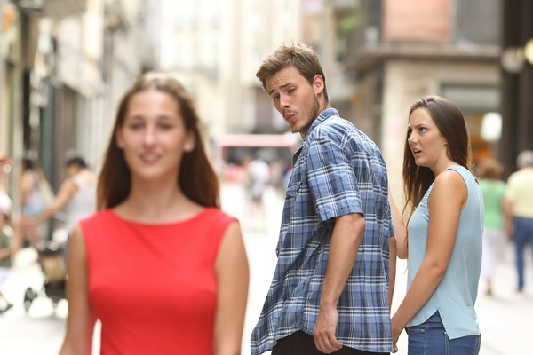
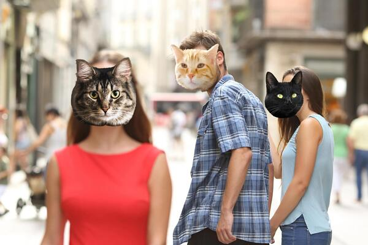

# 😺 face-swap-api

> Part of the **Weird API Challenge**

This project is a reference implementation for the "weird-api-challenge". It's designed to showcase how to build and structure a small, single-purpose API project that is quirky, minimal, and dockerized.

## 🔥 What does it do?

This API accepts a photo of one or more people and replaces their faces with random **cat faces**. It's powered by OpenCV for human face detection and Pillow for image manipulation.

## 🔗 Live Demo

Try it now: [https:/face-swap-api.up.railway.app/swap-faces](https://face-swap-api.up.railway.app/swap-faces)

> Upload a photo, get cat faces back — see example request below.

## ⚡ Example Input / Output

**Input:** Photo of a person or a group of people

**Output:** Same photo, with their faces replaced by cats' faces, returned as a JPEG image.

## 🧪 Example

**Original image:**



**Catified result:**



## 🪧 How to Run Locally (via Docker)

1. Clone the project:

```bash
git clone https://github.com/your-username/face-swap-api.git
cd face-swap-api
```

2. Make sure you have some cat face images inside a folder called `cat_faces/`.

3. Build the Docker image:

```bash
docker build -t face-swap-api .
```

4. Run the container:

```bash
docker run -p 8000:8000 face-swap-api
```

## 🚀 Make a Sample Request

You can use `curl` to send a POST request:

```bash
curl -X POST http://localhost:8000/swap-faces \
  -H "Content-Type: multipart/form-data" \
  -F "file=@your_photo.jpg" \
  --output result.jpg
```

This will save the resulting image as `result.jpg`.

## ⛔ Limitations

To protect resources and prevent abuse:

* ⚠️ **Rate limit**: Max 10 requests per IP per hour
* 📀 **File size limit**: Max 1 MB per upload

Requests that exceed these limits will be rejected with appropriate error messages (`413` or `429`).

## 🌍 Coming Soon

Once the main page of the **Weird API Challenge** is published, this README will be updated with a link.

## 🙏 Contributing

Feel free to fork, remix, or catify it further. Want to add dog faces? Goat overlays? Go wild.
